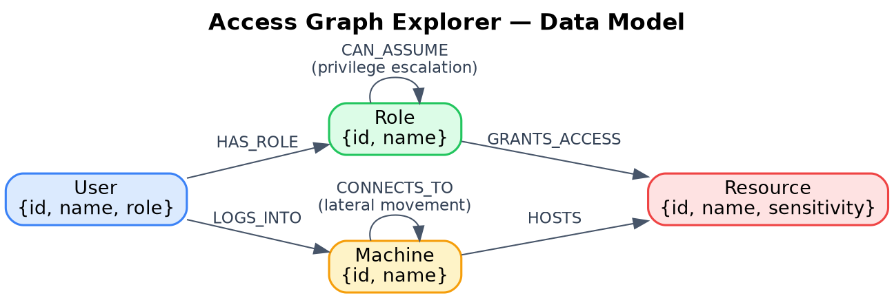

# Access Graph Explorer

A tool for tracing user access and potential attack paths through an
organization's roles, permissions, resources, and machines — built on
CognoDB (a Neo4j-compatible graph database).

## Why a graph database?

A user's *effective* access in an organization is rarely a single lookup — it's the end of a chain: which role they hold, whether that role can escalate to another, which machines they log into, which of those machines can reach other machines on the network, and what those machines ultimately expose. This is fundamentally a question about paths through a network of relationships, not rows in a table.

In a relational database, answering "what could this low-privilege user eventually reach?" means writing a recursive CTE that self-joins the same tables repeatedly for every hop, and that query gets slower and harder to read as the number of hops or relationship types grows. In CognoDB, the same question is a single variable-length pattern match — `[:HAS_ROLE|LOGS_INTO|CONNECTS_TO|CAN_ASSUME|GRANTS_ACCESS|HOSTS*1..6]` — that stays fast and readable no matter how large or interconnected the organization gets, because the relationships are stored as first-class citizens the database can traverse directly rather than reconstructed at query time through joins.

This mirrors how real security tools work: BloodHound, the industry-standard tool for mapping Active Directory attack paths, is built on exactly this idea — that privilege escalation and lateral movement are graph problems, and a graph database is what makes them tractable at scale.
## Data Model

   

Nodes:
- `User {id, name, role}`
- `Role {id, name}`
- `Resource {id, name, sensitivity}`
- `Machine {id, name}`

Relationships:
- `(User)-[:HAS_ROLE]->(Role)`
- `(Role)-[:GRANTS_ACCESS]->(Resource)`
- `(Role)-[:CAN_ASSUME]->(Role)` — privilege escalation
- `(User)-[:LOGS_INTO]->(Machine)`
- `(Machine)-[:CONNECTS_TO]->(Machine)` — network/lateral movement
- `(Machine)-[:HOSTS]->(Resource)`

## Setup

### 1. Create your CognoDB instance
1. Sign up at https://console.cognodb.com/signup (free, no card required).
2. Create a free (c0) instance and pick a region.
3. Copy the Bolt URI (`bolt+s://...`) and the generated password for user `cognodb` — shown once.

### 2. Backend
```bash
cd backend
cp .env.example .env   # fill in your CognoDB URI + password
npm install
npm run seed            # loads sample data
npm run dev              # starts API on http://localhost:4000
```

### 3. Frontend
```bash
cd frontend
npm install
npm run dev              # starts UI on http://localhost:5173
```

## Main queries explained

- **Direct access** (`GET /api/users/:id/direct-access`) — single-hop:
  user → role → resource. Straightforward in SQL too, included as a baseline.
- **Attack paths** (`GET /api/users/:id/attack-paths`) — the interesting one:
  a variable-length traversal (1–6 hops) across five different relationship
  types (`HAS_ROLE`, `LOGS_INTO`, `CONNECTS_TO`, `CAN_ASSUME`, `GRANTS_ACCESS`,
  `HOSTS`) to find every way a user could eventually reach a `critical`
  sensitivity resource. This is the kind of query a relational schema
  struggles with — it would need recursive CTEs and doesn't generalize
  well if the org's relationship types grow.

## Screenshots

 .png)

## Demo

https://access-graph-explorer.vercel.app/
https://access-graph-explorer.onrender.com
